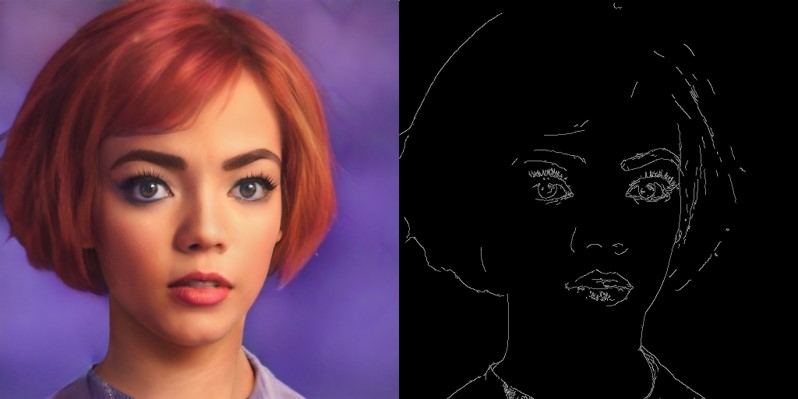
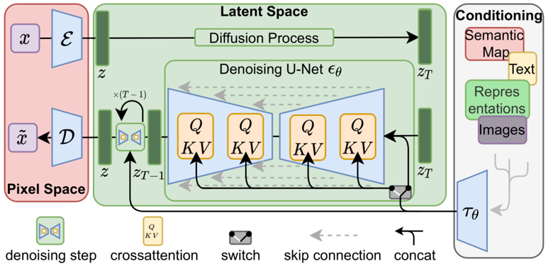
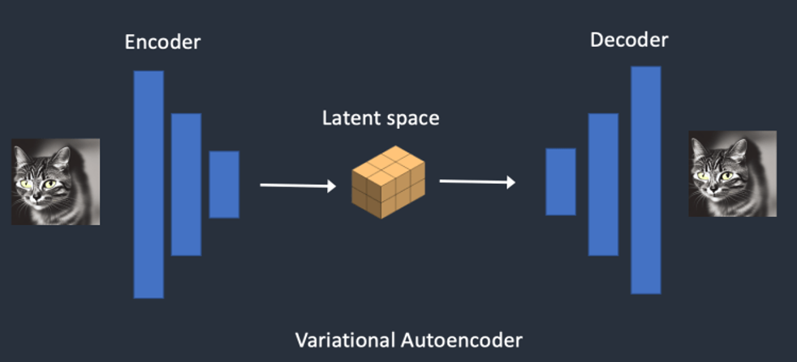
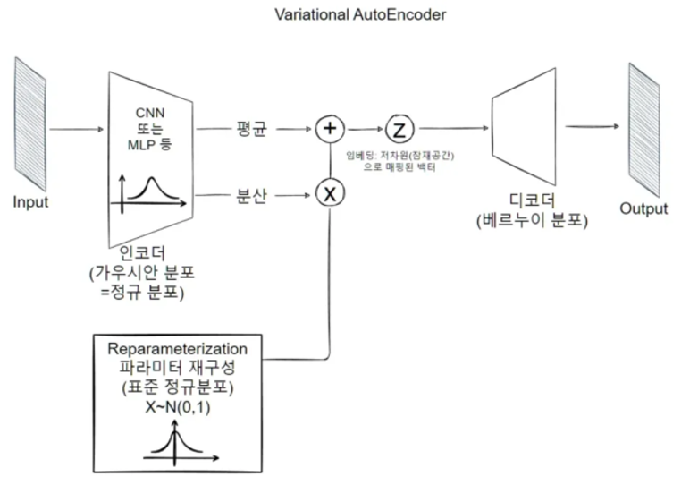
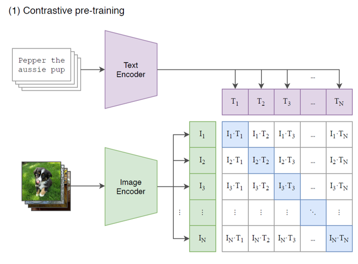
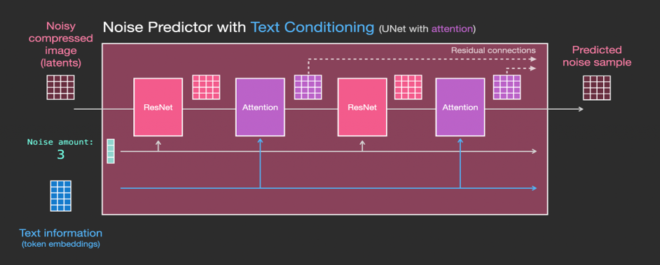
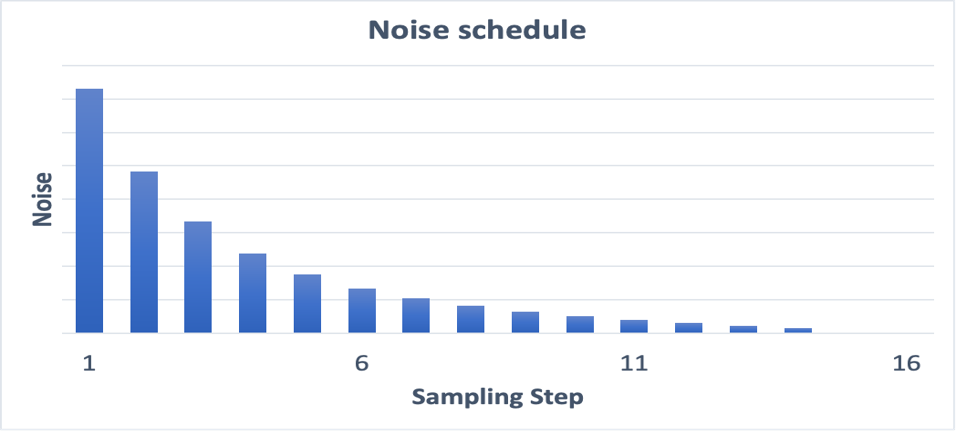

## DA35-4th-MMPP-MMPP
## 모델링 기법 선정 보고서
  
# 1. 프로젝트 주제 

1. 프로젝트의 목적 및 목표
    - 익명 채팅방의 프로필을 결정할 때 본인 얼굴을 프로필로 하기 부담스러움. 그래서 사용자가 본인정보를 기반으로 특정 아트 스타일이 적용된 프로필 사진을 자동으로 생성해 제공
  
2. 프로젝트가 해결하고자 하는 문제
    - 입력한 정보를 바탕으로한 프로필 이미지 생성
  
3. 예상되는 결과와 영향
    - 프로필 사진의 다양성 보충
    - 얼굴 사진 사용에 대한 부담감 감소
    - 프로필 작성 시 선택과 통일성 문제 해결

# 2. 데이터 설명

1. 사용 데이터 설명
    - 데이터 출처
        - Synthetic Face High Quality (SFHQ)
        - 주소 : https://www.kaggle.com/datasets/selfishgene/synthetic-faces-high-quality-sfhq-part-1?resource=download            
    - 데이터 타입: image
    - 데이터 크기: 1024 * 1024 
  
1. 데이터 전처리 과정 및 방법
    - canny를 이용하여 특성을 추출

# 3. 모델링 기법 후보    

### 1) 모델 기법

- Stable Diffusion
- Ltent Diffusion
- VAE
- CLIP
- U-Net
- Scheduler 

### 2) 구조

1. Stable Diffusion 

2. Latent Diffusion 

3. VAE  

4. CLIP  

5. U-Net  

6. Scheduler  

- step별로 노이즈의 정도 설정

# 4. 모델 선정 기준 및 모델링 기법들 비교
    1) 모델 선정 기준
        - SDXL : 안정적인 확산 모델을 기반으로 한다
        - Dreambooth : 특정 텍스트 토큰을 제공한 이미지의 Feature에 Overfitting 시켜  
                       해당 토큰이 포함된 이미지를 생성할 때 원하는 Feature를 생성할 수 있게 함
        - LoRA : 전체 Weight를 새로 학습하는 것보다는 성능이 낮을 수 있지만. 
                 빠른 학습 속도, 작은 용량, 확장성, 기존 학습 내용 보존 등의 다양한 이점을 제공
    >> BPP LoRA : 위 기법들을 융합하여 프로필 사진 생성에 특화된 모델을 제작 및 선정  

    2) 각 모델의 선정 기준 적합성
        - 각 모델의 성능 지표 비교
    3) 학습 시간 및 리소스 요구 사항 비교
        -
    4) 각 모델의 장단점 분석
        - 
# 5. 선정된 기법
    a. 최종 선정 모델링 기법
        - BPP LoRA
    b. 선정 이유
        - 각 기법의 장점을 융합하여 프로필 사진 생성에 유리하기 때문
    c. 선전 모델에 대한 설명
        - 모델 구조
            ControlNet: 레이어 수: 844, 파라미터 수: 1251014160
            VAE : 레이어 수: 248, 파라미터 수: 83653863
            StableDiffusionXL Base : 레이어 수: 1680, 파라미터 수: 2567463684
        - 사용된 기술
            - Pretrained 모델 사용 여부 및 어떤 부분을 미세 조정했는지

1) 모델 선정 기준
    - SDXL : 안정적인 확산 모델을 기반으로 한다
    - Dreambooth : 특정 텍스트 토큰을 제공한 이미지의 Feature에 Overfitting 시켜 해당 토큰이 포함된 이미지를 생성할 때 원하는 Feature를 생성할 수 있게 함
    - LoRA : 전체 Weight를 새로 학습하는 것보다는 성능이 낮을 수 있지만. 빠른 학습 속도, 작은 용량, 확장성, 기존 학습 내용 보존 등의 다양한 이점을 제공
  
2) 각 모델의 선정 기준 적합성
    - 각 모델의 성능 지표 비교
    -

3) 학습 시간 및 리소스 요구 사항 비교
    -

4) 각 모델의 장단점 분석
    -

# 5. 선정된 기법

a. 최종 선정 모델링 기법
    - ㅇㅇ
  
b. 선정 이유
    - ㅁㅁ
  
c. 선전 모델에 대한 설명
    - 모델 구조
        - 모델 아키텍처
        - 레이어 수, 노드 수, 파라미터 수
  
    - 사용된 기술
        - Pretrained 모델 사용 여부 및 어떤 부분을 미세 조정했는지
